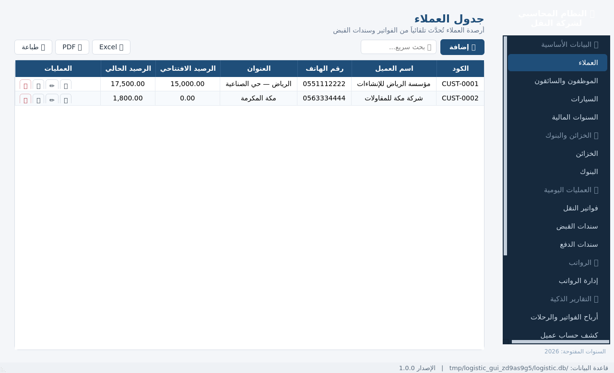
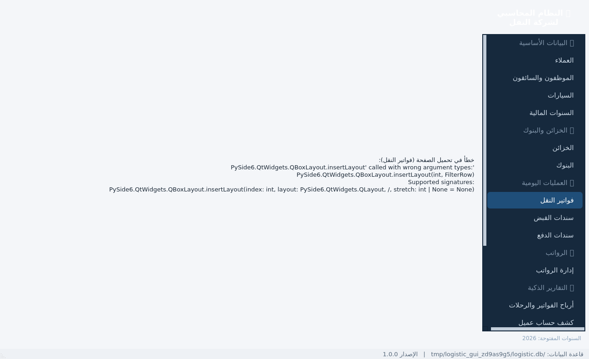
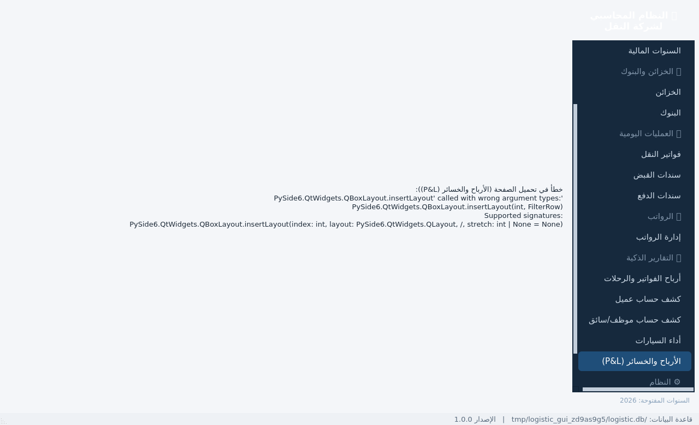

# 🚛 النظام المحاسبي المتكامل لشركة النقل

تطبيق سطح مكتب محلي (يعمل بدون إنترنت) لإدارة الحسابات لشركات النقل، مبني بـ **Python + PySide6 + SQLite** بواجهة عربية كاملة (RTL).





---

## ✨ الميزات (حسب وثيقة المواصفات)

### 🌟 قواعد عامة على مستوى النظام
- **التصدير والطباعة:** كل جدول/تقرير/كشف حساب مزوّد بأزرار **📊 Excel** و **📄 PDF** و **🖨️ طباعة** بتنسيق احترافي (ترويسة الشركة + جدول منسق + تذييل).
- **إدارة العمليات (CRUD):** بجانب كل حركة أزرار (عرض 👁️) (تعديل ✏️) (حذف 🗑️) + أزرار خاصة (كشف حساب 📄، طباعة فاتورة 🖨️، لقطة إغلاق 🖼️).
- **المعالجة التلقائية:** الأرصدة (العميل/الخزينة/البنك/ربح الرحلة/الأرباح العامة) تُحسب لحظياً من الحركات، فأي تعديل أو حذف يُعيد الاحتساب بأثر رجعي فوراً.
- **قاعدة السنوات المالية:** لا يمكن إضافة/تعديل/حذف أي حركة خارج نطاق سنة مالية **مفتوحة**.

### 📂 البيانات الأساسية
- **العملاء:** كود تلقائي، هاتف (نص يحفظ الأصفار)، رصيد افتتاحي، رصيد حالي تلقائي، ملاحظات، وزر **كشف حساب** بفلاتر تاريخ.
- **الموظفون والسائقون:** كود تلقائي، جنسية، نوع (سائق/إداري)، ملاحظات.
- **السيارات:** كود تلقائي، رقم اللوحة، النوع، سائق افتراضي.
- **السنوات المالية:** من/إلى تاريخ، حالة (مفتوحة/مغلقة)، إغلاق يولّد **لقطة إغلاق Snapshot** (أرصدة العملاء والخزائن والبنوك + أرباح السنة).

### 🏦 الخزائن والبنوك
- **الخزائن:** رصيد افتتاحي/حالي تلقائي + كشف حساب بكل حركات القبض والدفع.
- **البنوك:** رقم حساب + IBAN + رصيد تلقائي + كشف حساب.

### 🔄 العمليات اليومية
- **فواتير النقل:** رأس الفاتورة (عميل/تاريخ/مرفقات/ملاحظات) + نقلات (سيارة، سائق، من، إلى، سعر النقلة) + مصروفات لكل نقلة (تريب/بنزين/كارتة) + إجماليات (قيمة النقلات، المصروفات المباشرة، الربح المتوقع). إجمالي الفاتورة يضاف لمديونية العميل.
- **🖨️ طباعة فاتورة العميل:** فاتورة رسمية تخفي المصروفات والربح تماماً وتُظهر النقلات فقط + عبارة "غير خاضعة لضريبة القيمة المضافة (ZATCA)".
- **سندات القبض:** إيداع في خزينة/بنك؛ تحصيل من عميل (يقلل مديونيته) أو إيرادات أخرى (خردة/متنوع → الأرباح العامة).
- **سندات الدفع:** صرف من خزينة/بنك بأربعة توجيهات:
  - *مصروف يخص رحلة* → يُخصم من ربح النقلة بأثر رجعي.
  - *سلفة موظف/سائق* → تبقى مستحقة حتى خصمها من الرواتب.
  - *مصروف لسيارة (صيانة/كاوتش)* → يظهر في تقرير أداء السيارة.
  - *مصروف عام (إيجار/كهرباء)* → يُخصم من الربح العام.

### 💰 الرواتب
- إصدار راتب: الموظف، الشهر/السنة، جهة الصرف، الأساسي، إضافات + بيان، **سجل السلفيات غير المسددة يظهر تلقائياً** مع خصم كامل أو جزئي لكل سلفة، خصومات أخرى، والصافي = الأساسي + الإضافات − خصم السلف − الخصومات.

### 📊 التقارير الذكية (كلها بفلاتر تاريخ + Excel/PDF/طباعة)
1. **أرباح الفواتير والرحلات:** الإيراد − المصروف المباشر وقت الفاتورة − المصاريف اللاحقة من سندات الدفع = الربح الفعلي لكل نقلة.
2. **كشف حساب عميل:** الافتتاحي + الفواتير − سندات القبض = الرصيد الحالي.
3. **كشف حساب موظف/سائق:** الرواتب تفصيلياً + السلف وتواريخ سدادها + بدلات التريب من الفواتير.
4. **أداء السيارات:** إيراداتها − مصروفات رحلاتها − صيانتها = صافي الربحية.
5. **الأرباح والخسائر (P&L):** (إيرادات النقلات + إيرادات أخرى) − (مباشرة + رواتب صافية + سلفيات + صيانة + عامة).

---

## 🚀 التشغيل

### المتطلبات
- Python 3.10+ (مُختبر على 3.11)

### خطوات التشغيل
```bash
cd logistic
pip install -r requirements.txt
python main.py
```

عند أول تشغيل سيقترح البرنامج إنشاء السنة المالية الحالية تلقائياً. بعدها:
1. أدخل العملاء/الموظفين/السيارات/الخزائن/البنوك من **البيانات الأساسية** و**الخزائن والبنوك**.
2. عدّل بيانات الشركة (ترويسة الطباعة) من **الإعدادات**.
3. ابدأ تسجيل **فواتير النقل** و**سندات القبض/الدفع** و**الرواتب**.

### بيانات تجريبية (اختياري)
```bash
python scripts/seed_demo.py
```

### الاختبارات
```bash
# اختبار منطق النظام بالكامل (الأرصدة، القواعد، التقارير)
python scripts/smoke_test.py

# اختبار الواجهة آلياً offscreen + التقاط لقطات + تصدير Excel/PDF فعلي
QT_QPA_PLATFORM=offscreen python scripts/run_gui_check.py
```

---

## 🗄️ مكان البيانات
| النظام | المسار |
|---|---|
| Linux / macOS | `~/.logistic/data/logistic.db` |
| Windows | `C:\Users\<USER>\.logistic\data\logistic.db` |
| ملفات المرفقات | `~/.logistic/data/attachments/` |

- يمكن تغيير المجلد بمتغير البيئة `LOGISTIC_DATA_DIR`.
- نسخ احتياطي = نسخ ملف `logistic.db` (SQLite ملف واحد).

---

## 🧩 هيكل المشروع
```
logistic/
├── main.py                    # نقطة الإقلاع
├── requirements.txt
├── app/
│   ├── core/
│   │   ├── db.py              # الاتصال والمخطط الكامل (13 جدولاً)
│   │   ├── rules.py           # القواعد العامة (السنوات المالية، التحقق)
│   │   ├── repo.py            # CRUD كل الكيانات مع التحقق والمنع المحاسبي
│   │   └── calc.py            # محرك الأرصدة والكشوف والتقارير ولقطات الإغلاق
│   ├── utils/
│   │   ├── fmt.py             # تنسيقات (أرقام عربية، مبالغ، تواريخ)
│   │   ├── fonts.py           # اختيار خط عربي متوفر على أي نظام
│   │   └── exporter.py        # محرك Excel/PDF/الطباعة الموحد
│   └── ui/
│       ├── theme.py           # الثيم والألوان RTL
│       ├── widgets.py         # الجداول الذكية (CRUD) والنماذج والفلاتر
│       ├── main_window.py     # النافذة الرئيسية والتنقل
│       ├── dialogs_master.py  # نوافذ العملاء/الموظفين/السيارات/السنوات/الخزائن/البنوك/اللقطات
│       ├── dialogs_ops.py     # فاتورة النقل + سندات القبض/الدفع + طباعة فاتورة العميل
│       ├── dialogs_payroll.py # إصدار الراتب مع السلفيات
│       ├── statements.py      # كشوف الحساب المنفصلة
│       ├── pages_*.py         # صفحات الأقسام والتقارير الخمسة
│       └── page_settings.py   # إعدادات الشركة
└── scripts/
    ├── smoke_test.py          # 32 فحصاً لمنطق النظام
    ├── run_gui_check.py       # فحص آلي للواجهة + لقطات شاشة
    └── seed_demo.py           # بيانات تجريبية واقعية
```

## 🧠 قرارات محاسبية مضمّنة
- إجمالي فاتورة العميل = مجموع أسعار النقلات فقط (المصروفات داخلية تخصم من الربح).
- رصيد الخزينة/البنك = الافتتاحي + المقبوضات − المدفوعات − الرواتب المنصرفة.
- حذف فاتورة مرتبطة بسندات دفع (مصروف رحلة) **ممنوع** — تُحذف السندات أولاً.
- سلفة خُصمت في رواتب لا تُعدَّل ولا تُحذف إلا بعد حذف الرواتب المرتبطة (حفاظاً على الدقة).
- حذف راتب يُرجع السلف المخصومة إلى "غير مسددة" تلقائياً.

## 📝 ملاحظات
- الفاتورة الرسمية للعميل لا تخضع لـ ZATCA (عبارة قابلة للتعديل من الإعدادات).
- الأرقام العربية (٠-٩) مقبولة في كل حقول المبالغ تلقائياً.
- التطبيق يعمل دون أي اتصال بالإنترنت؛ بياناتك تبقى على جهازك.
